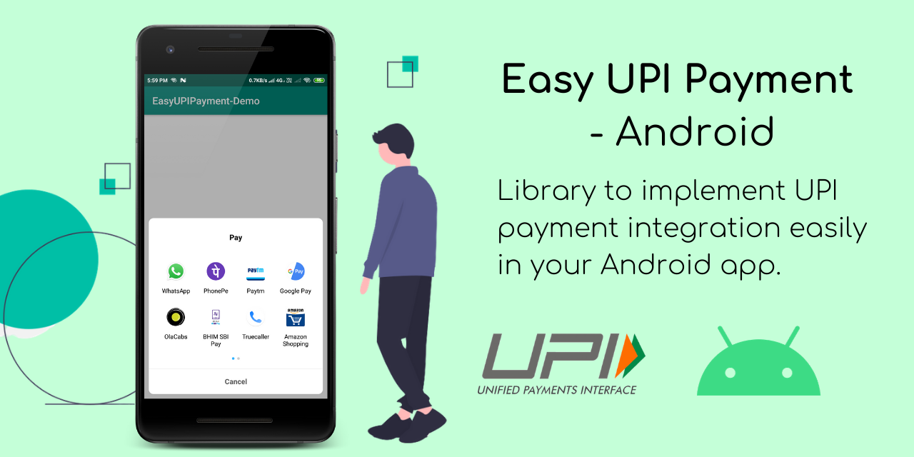
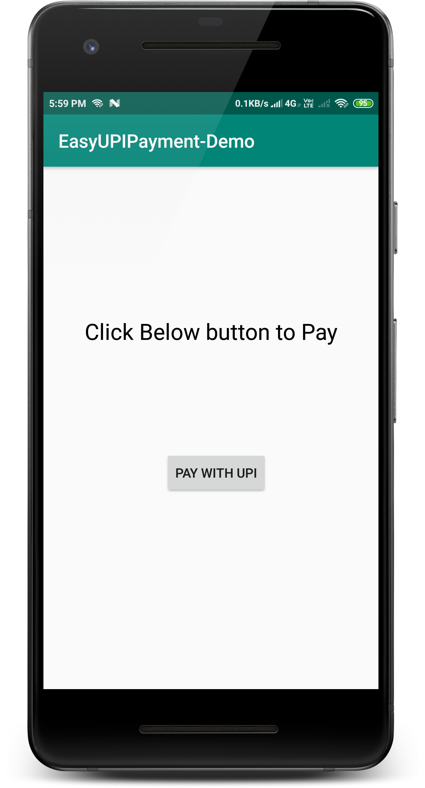
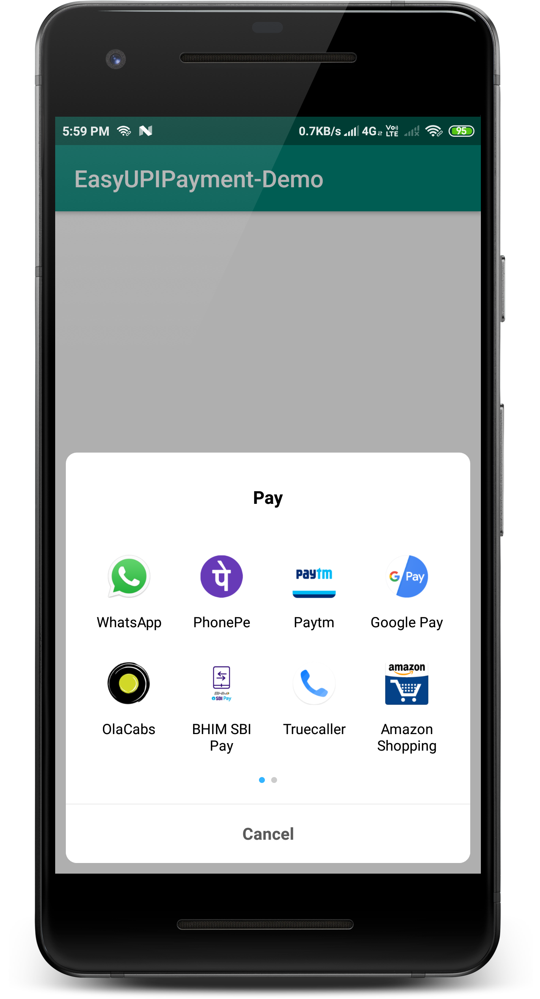
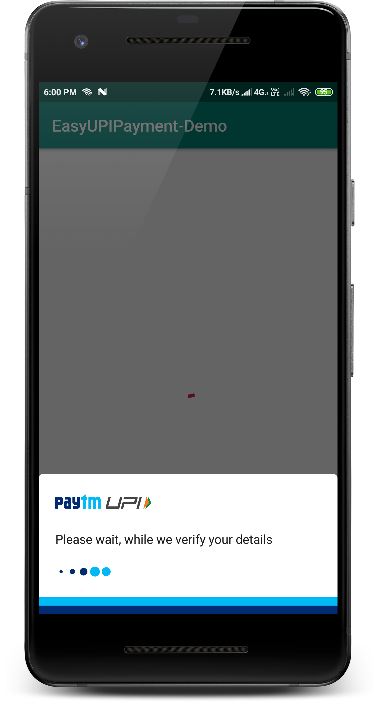
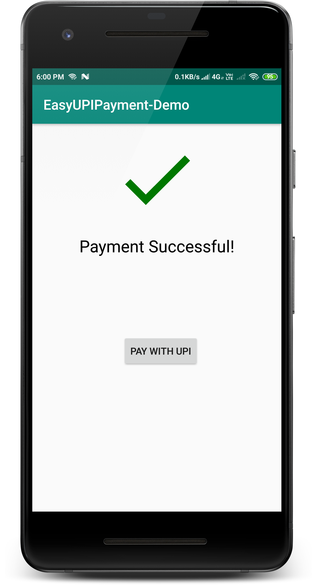

# Easy UPI Payment - Android Library 📱💳



## Introduction
Hello Everyone, I have developed this Android library to ***easily implement UPI Payment Integration in Android app.*** <br>
- UPI apps are *required to be installed already before using this library* because, internally this API calls UPI apps for payment processing. 
- Before using it, make sure that your device is having atleast one UPI app installed. Otherwise it will unable to process the payments. <br>
This API is in beta, there are lot of improvements are still needed.

## Demo 
<table style="width:100%">
  <tr>
    <th>1. Start</th>
    <th>2. Select UPI App</th> 
    <th>3. Complete Payment</th>
    <th>4. Finish</th>
  </tr>
  <tr>
    <td></td>
    <td></td> 
    <td></td>
    <td></td>
  </tr>
</table>

## Implementation
You can clone this repository and just import this project in Android Studio. Sample app is in [`/app`](/app) directory.

### Gradle
In your `build.gradle` file of app module, add below dependency to import this library

```gradle
    dependencies {
      implementation 'com.shreyaspatil:EasyUpiPayment:2.0'
    }
```

### Setting Up Activity
In Android app, make any activity where you want to implement payment integration. Here, I have created `MainActivity.java`

#### Initializing `EasyUpiPayment` :
You can see below code, these are minimum and mandatory calls to enable payment processing. If any of it is missed then error will generated.
```java
        final EasyUpiPayment easyUpiPayment = new EasyUpiPayment.Builder()
                .with(this)
                .setPayeeVpa("EXAMPLE@VPA")
                .setPayeeName("PAYEE_NAME")
                .setTransactionId("UNIQUE_TRANSACTION_ID")
                .setTransactionRefId("UNIQUE_TRANSACTION_REF_ID")
                .setDescription("DESCRIPTION_OR_SMALL_NOT")
                .setAmount("AMOUNT_IN_DECIMAL_XX.XX")
                .build();
```
**Calls and Descriptions :**

<table>
  <tr>
    <th>Method</th>
    <th><span style="font-weight:bold">Mandatory</span></th>
    <th>Description</th>
  </tr>
  <tr>
    <td>with()</td>
    <td>✔️</td>
    <td>This call takes Activity as a parameter where Payment is to be implemented<br></td>
  </tr>
  <tr>
    <td>setPayeeVpa()</td>
    <td>✔️</td>
    <td>It takes VPA address of payee for e.g. <span style="font-weight:600">shreyas@upi</span></td>
  </tr>
  <tr>
    <td>setTransactionId()</td>
    <td>✔️</td>
    <td>This field is used in Merchant Payments generated by PSPs.</td>
  </tr>
  <tr>
    <td>setTransactionRefId()</td>
    <td>✔️</td>
    <td>Transaction reference ID. This could be order number, subscription number, Bill ID, booking ID, insurance renewal reference, etc. Needed for merchant transactions and dynamic URL generation. This is mandatory because absencse of this field generated error in apps like PhonePe</td>
  </tr>
  <tr>
    <td>setDescription()</td>
    <td>✔️</td>
    <td>To provide a valid small note or description about payment. for e.g. <br><span style="font-style:italic">For Food</span><br></td>
  </tr>
  <tr>
    <td>setAmount()</td>
    <td>✔️</td>
    <td>It takes the amount in String decimal format (xx.xx) to be paid. <br>For e.g. 90.88 will pay <span style="font-style:italic">Rs. 90.88.</span></td>
  </tr>
  <tr>
    <td>setPayeeMerchantCode()</td>
    <td></td>
    <td>Payee Merchant code if present it should be passed.</td>
  </tr>
  <tr>
    <td>build()</td>
    <td>✔️</td>
    <td>It will build and returns the <span style="font-weight:bold;font-style:italic">EasyUpiPayment</span> instance.</td>
  </tr>
</table>

#### App-Specific Payment
If you want to pay only with specific app like BHIM UPI, PhonePe, PayTm, etc. Then you can use method `setDefaultPaymentApp()` of `EasyUpiPayment`.

Following ENUM can be passed to this method.
- `PaymentApp.BHIM_UPI`
- `PaymentApp.AMAZON_PAY`
- `PaymentApp.GOOGLE_PAY`
- `PaymentApp.PHONE_PE`
- `PaymentApp.PAYTM`

Example:
```java
easyUpiPayment.setDefaultPaymentApp(PaymentApp.BHIM_UPI);
``` 

After this while payment, this app will be opened for transaction.

#### Proceed to Payment
To start the payment, just call `startPayment()` method of EasyUpiPayment and after that transaction is started.
```java
      easyUpiPayment.startPayment();
```

#### Event Callback Listeners
To register for callback events, you will have to set `PaymentStatusListener` with `EasyUpiPayment` as below.
```java
        easyUpiPayment.setPaymentStatusListener(this);
```
**Description :**

* `onTransactionCompleted()` - This method is invoked when transaction is completed. It may either `SUCCESS`, `SUBMITTED` or `FAILED`.
> **NOTE - If onTransactionCompleted() is invoked it doesn't means that payment is successful. It may fail but transaction is completed is the only purpose.**
* `onTransactionSuccess()` - Invoked when Payment is successful.
* `onTransactionSubmitted()` - Invoked when Payment is partially done/In waiting/Submitted/Pending.
* `onTransactionFailed()` - Invoked when Payment is unsuccessful/failed.
* `onTransactionCancelled()` - Invoked when Payment cancelled (User pressed back button or any reason).
* `onAppNotFound();` - Invoked when app specified with `setDefaultPaymentApp()` is not exists on devie.
```java
    @Override
    public void onTransactionCompleted(TransactionDetails transactionDetails) {
        // Transaction Completed
        Log.d("TransactionDetails", transactionDetails.toString());
        statusView.setText(transactionDetails.toString());
    }

    @Override
    public void onTransactionSuccess() {
        // Payment Success
        Toast.makeText(this, "Success", Toast.LENGTH_SHORT).show();
        imageView.setImageResource(R.drawable.ic_success);
    }

    @Override
    public void onTransactionSubmitted() {
        // Payment Pending
        Toast.makeText(this, "Pending | Submitted", Toast.LENGTH_SHORT).show();
        imageView.setImageResource(R.drawable.ic_success);
    }

    @Override
    public void onTransactionFailed() {
        // Payment Failed
        Toast.makeText(this, "Failed", Toast.LENGTH_SHORT).show();
        imageView.setImageResource(R.drawable.ic_failed);
    }

    @Override
    public void onTransactionCancelled() {
        // Payment Cancelled by User
        Toast.makeText(this, "Cancelled", Toast.LENGTH_SHORT).show();
        imageView.setImageResource(R.drawable.ic_failed);
    }
    
    @Override
    public void onAppNotFound() {
        // App Not exists on Device 
        Toast.makeText(this, "App Not Found", Toast.LENGTH_SHORT).show();
    }
```

### Removing Listener
To remove listeners, you can invoke `detachListener()` after the transaction is completed or you haven’t to do with payment callbacks.
```java
easyUpiPayment.detachListener();
```

### Getting Transaction Details
To get details about transactions, we have callback method `onTransactionCompleted()` with parameter of `TransactionDetails`. TransactionDetails instance includes details about previously completed transaction.  <br>
To get details, below method of `TransactionDetails` are useful :

<table>
  <tr>
    <th>Method</th>
    <th>Description</th>
  </tr>
  <tr>
    <td>getTransactionId()</td>
    <td>Returns Transaction ID</td>
  </tr>
  <tr>
    <td>getResponseCode()</td>
    <td>Returns UPI Response Code</td>
  </tr>
  <tr>
    <td>getApprovalRefNo()</td>
    <td>Returns UPI Approval Reference Number (beneficiary)</td>
  </tr>
  <tr>
    <td>getStatus()</td>
    <td>Returns Status of transaction.<br>(Submitted/Success/Failure)<br></td>
  </tr>
  <tr>
    <td>getTransactionRefId()</td>
    <td>Returns Transaction reference ID passed in input</td>
  </tr>
</table>

Hurrah.... We have successfully implemented UPI integration in our Android app.
Thank You!

## Contribute
We can collaboratively make it happen. So if you have any issues, new ideas about implementations then just raise issue and we are open for Pull Requests. Improve and make it happen.
See [Contributing Guidelines](CONTRIBUTING.md). 

## License
Project is published under the Apache 2.0 license. Feel free to clone and modify repo as you want, but don't forget to add reference to authors :)
