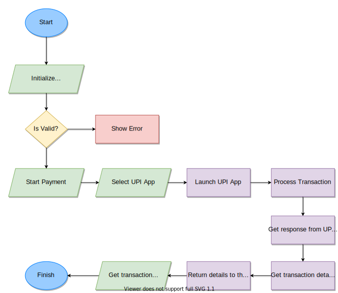
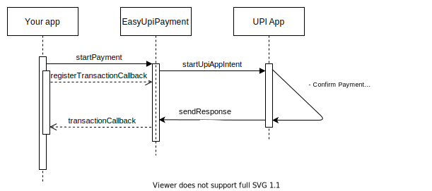

# Easy UPI Payment - Android Library

Welcome! If you want to integrate UPI payments in Android app then you're at right place.

## Introduction

- This library acts as a mediator between your app and UPI apps (_which are already installed in device_).
- This library is based on [**_these_**](https://www.npci.org.in/sites/default/files/UPI%20Linking%20Specs_ver%201.6.pdf) specifications provided by _NPCI (National Payments Corporation of India)_.
- This library is based on Android Intent based operations.
- Whenever payment is initiated, it simply sends the `Intent` to the UPI apps installed on device.
- When transaction is done, response is returned from library.

## Flow

Below flow will help you to understand the flow of using UPI payments using this library.

## Sequence

Below sequence diagram will help you to understand sequence of events happening between different layers.

## Demo Flow (Screenshots)

<table style="width:100%">
  <tr>
    <th>1. Start</th>
    <th>2. Select UPI App</th> 
    <th>3. Complete Payment</th>
    <th>4. Finish</th>
  </tr>
  <tr>
    <td></td>
    <td></td> 
    <td></td>
    <td></td>
  </tr>
</table>
